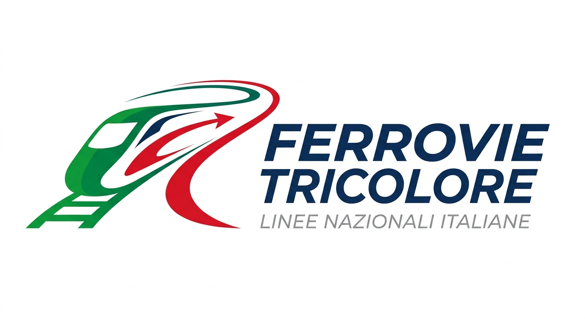
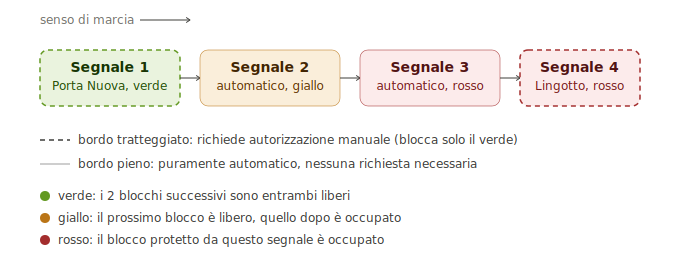
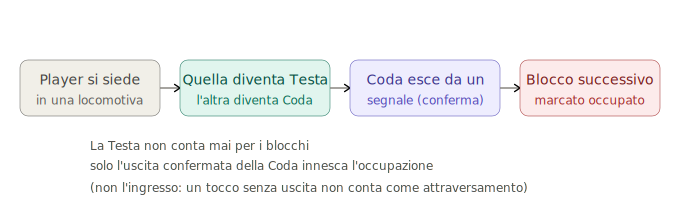

# Ferrovie Tricolore

*Working title during development: "Ita Rails." Scripts, folders, and variables inside the project still use this name and will be renamed at release, not before.*

A train simulator built in Roblox Studio, starting from Torino Porta Nuova. The goal isn't arcade-style train driving; it's getting the operational details right: real station positions pulled from OpenStreetMap, track geometry following actual GPX route data, block signaling that follows RFI conventions, and a station clock that's synced to whatever time it actually is in Italy right now.

This describes the project's current state. For a dated, session-by-session account of what changed and why, see [CHANGELOG.md](CHANGELOG.md).

---

## What's actually running

- **Dynamic train composition.** Carriages aren't baked into a fixed train model. The number of carriages is variable per spawn, built from a template stored in `ServerStorage`.
- **Cab controls that do something.** Front/rear lights, horn (3-phase, server-driven so it's audible to everyone nearby, not just the driver), pantograph toggle, doors, all wired through a `RemoteEvent` so state stays consistent across clients.
- **Stations from real data, not placed by hand.** A Python script (`genera_stazioni_v2.py`) hits the Overpass API for OpenStreetMap railway station data and drops ~3,000 markers into the world at 1:200 scale. Manually placing that many stations wasn't an option.
- **Track built from GPX, not eyeballed.** Real route data run through a Catmull-Rom spline generator produces the physical track. Getting tile placement gap-free took finding the correct `CFrame.fromMatrix` construction; an off-by-basis-vector error had been leaving visible seams between tiles.
- **The station clock is the real time in Italy, not a prop.** `os.date("*t", os.time() + 3600)`, synced to the system clock with a DST adjustment. It drives the analog and digital clocks on the departure boards.
- **Real 2-block lookahead signaling, four signals in sequence.** Not a placeholder anymore: each signal computes its own aspect from whether the next block is occupied (red), the one after that is occupied (yellow), or both are clear (green). The two station signals (Torino Porta Nuova and Lingotto) additionally require a manual "request departure" grant before they'll ever show anything but red. The gate blocks green specifically, not yellow or red, so a station signal still shows an honest warning even without authorization. Occupancy is tracked by a single collider (tagged "Coda," assigned dynamically to whichever locomotive the player is *not* driving from) crossing a signal zone on exit, not entry. Entering a zone means nothing on its own; only a confirmed exit counts.
- **Departure boards know which station they're in, not just which platform number.** Both stations have a "Binario 1" and a "Binario 2." A board that only checked the platform number couldn't tell Porta Nuova's Binario 1 from Lingotto's Binario 1, and would light up both at once. Fixed by walking up to the nearest `Stazione` ancestor as well as the nearest `Binario` one.

---

## Two bugs worth writing down, because they were both wrong in ways that looked right

**The delay display showed "+636 minutes."** Early version of the on-time/late calculation compared the real-world clock against a hardcoded scheduled departure of `"08:05"`. That's fine if you start the game at 8:05am. Start it at any other time of day, which is every time since the game runs on real Italian time, and the "delay" is just however many hours have passed since 8am, dressed up as a train running arbitrarily late. The fix wasn't a math correction; it was realizing the whole comparison had no anchor to reality. Fixed by tying scheduled departures to the same real-clock system the station clock already used, instead of a fake fixed value.

**A flashing departure indicator that never flashed.** Two platform signs, each supposed to alternate a "Depart 1 / Depart 2" light. One flashed, the other stayed permanently lit. Turned out the light-toggling code was correct: the bug was that a hidden `TEMPLATE` object (meant to be an invisible blueprint for cloning, per the existing pattern used elsewhere in the same model) had been left `Visible = true` on the duplicated sign, sitting exactly on top of the real, correctly-blinking light and masking it. Fixed by hiding the leftover templates, not by touching the blink logic, which had been right the whole time. 21 stray visible templates were found across both platform duplicates once this was checked properly instead of assumed.

**The clock was tested correct, then got wrong again from the same bug twice.** The Italian-time calculation adds a DST-aware offset to a UTC timestamp; that part was right. The mistake: passing the result to `os.date("*t", ...)` without forcing UTC interpretation. Without that, Roblox Studio (which runs on the developer's own machine) applies the *system's own local timezone* on top, silently double-converting. It went unnoticed at first because the dev machine happened to be set to Italian time, so the double-conversion partially canceled out during casual testing. It only became obvious when a real published server, which runs in UTC, was accounted for: without forcing UTC explicitly (`os.date("!*t", ...)`), the same code is correct on one machine and wrong on every other one, for a reason that has nothing to do with the DST math itself.

**Renaming four signals broke a system that had nothing to do with their names.** Signals were renamed to include a `(stazione)` tag marking which ones require manual departure authorization. Reasonable change, except the signal-ordering code extracted "which signal comes next" by matching a number at the *very end* of the name (`%d+$`), and `"Semaforo singolo 1 (stazione)"` doesn't end in a digit anymore. Two signals silently sorted as position zero, tied with each other, and the whole lookahead chain scrambled. Not because the block-signal logic was wrong, but because a naming change several files away broke a pattern match nobody thought to re-check. Fixed by matching the first number anywhere in the name instead of the last one, and by keying "does this signal need manual authorization" off the tag directly instead of off array position.

---

## What isn't done yet, ranked by what breaks the experience first

1. **Train spawn position is off by ~176 studs on the X axis.** `PivotTo` is being applied against a different part than the one the template CFrame was captured from: `FindFirstChildWhichIsA("BasePart", true)` doesn't reliably return the same part twice on a multi-part model. Needs the template's pivot anchored explicitly before it's moved to `ServerStorage`, not resolved lazily at clone time.
2. **The red signal doesn't actually stop anything.** A train can run a red light right now: the signal changes color, nothing enforces it. Freeze-at-red (a forced but non-instant deceleration, not a hard stop, to avoid snapping the coupling) is designed but not built.
3. **Six of seven routes in the menu go nowhere.** Only Torino → Lingotto has real track behind it. The rest are selectable and silently spawn on the wrong track.
4. **Platform 2 has rails but no spawn point.** Same root cause as #1; will get fixed alongside it, same logic, different platform.
5. **Coupling between carriages is a prototype, not a system.** A buffer-block pair exists on one joint as proof of concept (0.15-stud gap at rest, verified). The old `RopeConstraint`-based coupling is still present elsewhere and needs replacing, not just supplementing.
6. **Lingotto's departure boards are structurally incomplete, not just unwired.** All 20 platform boards at Porta Nuova have the internal template a board needs to clone and display live data; all 7 at Lingotto are missing it, confirmed by triggering the exact warning the board-controller script logs when it can't find one, once for every single Lingotto board. The routing logic that decides *which* board should be active is correct and tested; it has nothing to route to at Lingotto until the boards there are rebuilt from a working Porta Nuova one. A duplicate, empty "Cartello orari" object was also found sitting alongside a real one at Lingotto's Platform 2, likely the same copy-paste that left the templates out.

---

## What's designed but not started

Block signaling (see above) is real now, tested against the exact aspect sequence a train produces as it crosses four signals in a row, not just spot-checked at rest. Double-yellow and flashing-yellow exist in the real RFI system for edge cases (short platforms, reduced-distance signal spacing), and are deliberately still deferred: the base 3-aspect version earned its place first.

The tail-sensor problem this used to be blocked on turned out to have a simpler answer than "attach a sensor to whichever carriage is last": trains run with a locomotive at *each* end, so tagging whichever one the player *isn't* driving from as "tail," decided fresh each time someone sits down, sidesteps tracking carriage count at all.

**Incident detection**, in order of how hard each one actually is: buffer collision (cheap, a velocity check on an existing `Touched` event), then train-on-train collision (same idea), then derailment. Derailment is the expensive one: the train's movement isn't physically coupled to the rail geometry, so "off the rails" isn't a concept the game currently has any way to detect. It needs distance-from-spline tracking built from scratch, not a flag that already exists somewhere.

**Scoring**, concept stage: points for passengers/cargo delivered, signal compliance, on-time arrival within a 2-minute window. Point values per event aren't decided yet. A "traffic controller" player role is tied to this: a human overriding the automated block signaling, same system as above with a manual layer on top.

**Cosmetic shop.** Deliberately not scoped alongside everything else above. `ProcessReceipt` handled wrong doesn't just create a bug; it can fail to deliver a paid purchase or let it be duplicated. Gets its own pass when it's actually next in line, not folded into a sprint with unrelated UI work.

---

## Built on

Roblox Studio (Luau) · Python for the OSM data pipeline · Blender for train and signal models · real GPX route data for track geometry

---

© 2026 Tommy Raffaello Hodoroaba (73K-Y). All rights reserved. See [LICENSE](LICENSE).
