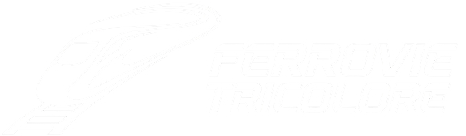
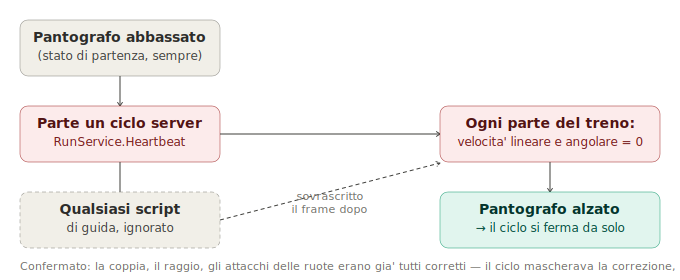
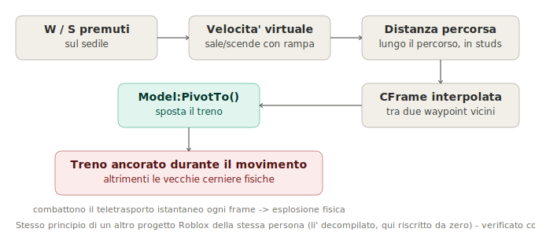
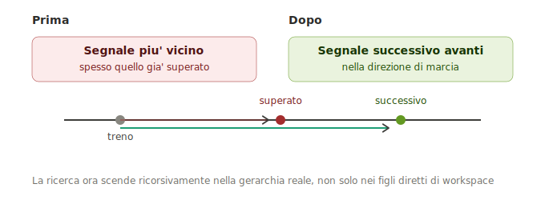
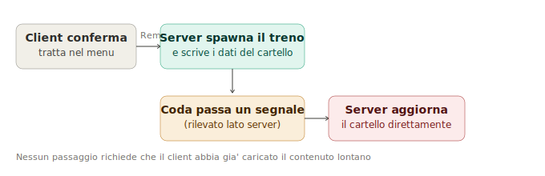
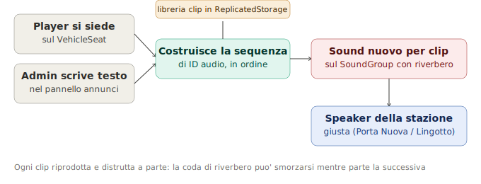

# Ferrovie Tricolore

---

## 🇮🇹 Cos'è

Un simulatore ferroviario in Roblox Studio, a partire da Torino Porta Nuova. Priorità sui dettagli operativi veri, non sulla guida arcade: stazioni reali da OpenStreetMap, binario da dati GPX, segnalamento a blocchi in stile RFI, orologio di stazione sincronizzato all'ora vera in Italia.

Questo file descrive lo stato attuale. Per la cronologia sessione per sessione, vedi [CHANGELOG.md](CHANGELOG.md).

## 🇬🇧 What this is

A train simulator in Roblox Studio, starting from Torino Porta Nuova. Priority on real operational detail, not arcade driving: real stations from OpenStreetMap, GPX-derived track, RFI-style block signaling, a station clock synced to real Italian time.

This file describes the current state. For the session-by-session history, see [CHANGELOG.md](CHANGELOG.md).

---

## 🇮🇹 Cosa funziona

- **Composizione treno dinamica**, numero di carrozze variabile a ogni spawn.
- **Comandi di cabina reali**: luci, clacson a 3 fasi lato server, pantografo, porte, tutto sincronizzato tra client via `RemoteEvent`.
- **~3.000 stazioni reali** piazzate da un'estrazione OpenStreetMap (`genera_stazioni_v2.py`), scala 1:200.
- **Binario da dati GPX veri**, generato con spline Catmull-Rom.
- **Orologio di stazione sull'ora vera in Italia**, con correzione ora legale, guida gli orologi dei cartelli.
- **Segnalamento a blocchi reale, 4 segnali in sequenza**, ciascuno calcola rosso/giallo/verde dall'occupazione dei due blocchi successivi. I segnali di stazione richiedono in più un'autorizzazione manuale di partenza. Occupazione tracciata da un collider "Coda" (assegnato dinamicamente alla locomotiva che il giocatore non guida) in uscita da ogni zona segnale, non in entrata.
- **Cartelli partenze gestiti interamente lato server**, stesso script che rileva testa/coda del treno a ogni segnale. Una sola tratta riconosciuta oggi (Porta Nuova binario 1 verso Lingotto binario 2), scritta a mano.
- **Pannello admin** modifica il testo scorrevole dei cartelli per l'intero progetto, protetto da ID utente.
- **Cartelli con icona categoria vera** (R, RV, IC, ICN, Frecciarossa, Italo) e logo aziendale.
- **Display di cabina del prossimo segnale** ora cerca ricorsivamente e sceglie il segnale corretto avanti al treno, non solo il più vicino in assoluto.
- **Annunci di stazione audio veri**, 93 clip assemblate in sequenza parlata da un modulo (`AnnunciTreno`), con riverbero per stazione. Anche un pannello a testo libero per annunci personalizzati.
- **Menu selezione tratta a tre colonne** (tratta, tipo treno, anteprima).
- **Selettore stazione prima del menu tratta**, con teletrasporto a un vero `SpawnLocation` e copertura a schermo intero durante il caricamento.
- **Limiti di velocità funzionanti**: zone invisibili con attributo `SpeedLimit`, cartello rosso/bianco con il limite dentro il pannello guida. Solo 3 zone di prova vicino a Porta Nuova per ora.
- **Prima persona su C**, segue la testa vera del personaggio. FOV regolabile (50-120°) nel pannello impostazioni.
- **Movimento a waypoint**, alternativa alla fisica delle ruote (mai stata affidabile). Il treno segue una sequenza di `CFrameValue`, interpolando la posizione con `PivotTo`, ancorato durante il movimento per non entrare in conflitto con le vecchie cerniere fisiche.

## 🇬🇧 What's working

- **Dynamic train composition**, carriage count varies per spawn.
- **Real cab controls**: lights, 3-phase server-side horn, pantograph, doors, synced across clients via `RemoteEvent`.
- **~3,000 real stations** placed from an OpenStreetMap extraction (`genera_stazioni_v2.py`), 1:200 scale.
- **Track from real GPX data**, generated with a Catmull-Rom spline.
- **Station clock on real Italian time**, DST-corrected, drives the board clocks.
- **Real block signaling, 4 signals in sequence**, each computing red/yellow/green from the next two blocks' occupancy. Station signals additionally require manual departure authorization. Occupancy tracked by a "Coda" collider (dynamically assigned to whichever locomotive the player isn't driving) exiting each signal zone, not entering.
- **Departure boards run entirely server-side**, same script that detects the train's head/tail at each signal. One route recognized today (Porta Nuova platform 1 to Lingotto platform 2), hand-coded.
- **Admin panel** edits the boards' scrolling text project-wide, gated by user ID.
- **Boards show a real category icon** (R, RV, IC, ICN, Frecciarossa, Italo) and a company logo.
- **Cab next-signal display** now searches recursively and picks the correct signal ahead of the train, not just the nearest one overall.
- **Real audio station announcements**, 93 clips assembled into a spoken sequence by a module (`AnnunciTreno`), with per-station reverb. Plus a free-text panel for custom one-off announcements.
- **Three-column route menu** (route, train type, preview).
- **Station picker before the route menu**, teleporting to a real `SpawnLocation` with a full-screen loading cover.
- **Working speed limits**: invisible zones with a `SpeedLimit` attribute, a red/white sign inside the driving HUD. Only 3 test zones near Porta Nuova so far.
- **First-person on C**, tracks the character's real head. Adjustable FOV (50-120°) in settings.
- **Waypoint-based movement**, an alternative to wheel physics (never reliable). The train follows a `CFrameValue` sequence, interpolating position with `PivotTo`, anchored during movement to avoid fighting the old physical hinges.

---

## 🇮🇹 Bug degni di nota

**Ritardo mostrato: "+636 minuti."** Il calcolo confrontava l'ora reale con una partenza fissa scritta a mano (`"08:05"`), funzionante solo se avvii il gioco esattamente a quell'ora. Corretto legando le partenze allo stesso orologio reale della stazione.

**Un indicatore che non lampeggiava mai.** Il codice di lampeggio era corretto; un `TEMPLATE` nascosto era rimasto visibile sopra la luce vera, mascherandola. 21 template dimenticati trovati in totale.

**L'orologio giusto su una macchina, sbagliato su ogni altra.** Mancava forzare l'interpretazione UTC in `os.date`; senza, Roblox applica sopra anche il fuso locale del sistema. Passato inosservato perché il computer di sviluppo era per caso già sull'ora italiana.

**Rinominare 4 segnali ha rotto l'ordinamento.** Il codice cercava un numero alla fine esatta del nome; aggiungere un tag `(stazione)` alla fine ha rotto quel pattern match. Corretto cercando il primo numero ovunque nel nome.

## 🇬🇧 Bugs worth noting

**Delay shown as "+636 minutes."** The calculation compared real time against a hardcoded departure ("08:05"), only correct if you start the game at that exact time. Fixed by tying scheduled departures to the same real station clock.

**An indicator that never blinked.** The blink code was correct; a hidden `TEMPLATE` had been left visible on top of the real light, masking it. 21 stray templates found in total.

**A clock right on one machine, wrong on every other.** Missing forced UTC interpretation in `os.date`; without it, Roblox also applies the system's own local timezone on top. Went unnoticed because the dev machine happened to already be on Italian time.

**Renaming 4 signals broke their ordering.** The code matched a number at the exact end of the name; adding a `(stazione)` tag at the end broke that pattern. Fixed by matching the first number anywhere in the name.

---

## 🇮🇹 Cosa manca, in ordine di impatto

0. **Movimento fisico delle ruote mai affidabile**, accantonato per i waypoint (vedi sopra). Ruote/bogie continueranno a girare solo in modo cosmetico, calcolato dalla velocità, non ancora costruito.
1. **Spawn del treno sfalsato di ~176 studs** sull'asse X. `PivotTo` applicato contro la parte sbagliata del template.
2. **Il segnale rosso non ferma nulla fisicamente.** Progettato, non costruito.
3. **6 tratte su 7 nel menu non portano da nessuna parte.**
4. **Marciapiede 2 senza punto di spawn.**
5. **Aggancio carrozze ancora un prototipo.**
6. **Errore ripetuto in uno script HUD di cabina**, non ancora indagato.
7. **Cartella "Test" da 251 oggetti**, mai confermata sicura da cancellare.
8. **Impostazioni audio/HUD salvate ma non collegate a nulla.**
9. **Ventaglio di Porta Nuova ancora solo una guida**, non binario vero. Più tentativi falliti nella sessione del 12-13 luglio; vedi changelog.

## 🇬🇧 What's missing, ranked by impact

0. **Physics-based wheel movement never reliable**, set aside for waypoints (see above). Wheels/bogies will keep spinning only cosmetically, driven by speed, not yet built.
1. **Train spawn offset by ~176 studs** on the X axis. `PivotTo` applied against the wrong template part.
2. **Red signal doesn't physically stop anything.** Designed, not built.
3. **6 of 7 routes in the menu go nowhere.**
4. **Platform 2 has no spawn point.**
5. **Carriage coupling still a prototype.**
6. **Repeating error in a cab HUD script**, not yet investigated.
7. **A "Test" folder with 251 objects**, never confirmed safe to delete.
8. **Audio/HUD settings save but connect to nothing.**
9. **Porta Nuova fan is still only a guide**, not real track. Several failed attempts during the July 12-13 session; see changelog.

---

## 🇮🇹 Progettato ma non iniziato

Block signaling (sopra) è reale e testato su una sequenza completa di attraversamento. Doppio giallo e giallo lampeggiante esistono nel sistema RFI vero per casi limite, rimandati apposta.

Testa e coda sono assegnate dinamicamente a ogni spawn (qualunque locomotiva il giocatore non guidi diventa "coda"), evitando di dover tracciare il numero di carrozze.

**Rilevamento incidenti**: collisione respingenti (economico), poi treno-treno, poi deragliamento (costoso, richiede tracciamento della distanza dalla spline, non esiste ancora).

**Punteggio**: passeggeri consegnati, rispetto segnali, puntualità entro 2 minuti. Valori non ancora decisi. Un ruolo "controllore del traffico" è legato a questo.

**Geometria reale del binario per l'intera Torino-Genova**, da tile ripetute a sezioni Blender. Un corridoio geografico reale (4.321 segmenti OSM, 33.387 punti) è già stato estratto. Nodo irrisolto: quel corridoio usa la scala geografica vera, le stazioni già in gioco usano una scala compressa (rapporto misurato 1:3.83, scelto apposta per il gameplay). Riconciliare le due scale resta da decidere stazione per stazione.

**Negozio cosmetico.** Deliberatamente rimandato: un `ProcessReceipt` gestito male rischia di non consegnare un acquisto pagato, non solo un bug estetico.

## 🇬🇧 Designed but not started

Block signaling (above) is real and tested across a full crossing sequence. Double-yellow and flashing-yellow exist in the real RFI system for edge cases, deliberately deferred.

Head and tail are assigned dynamically on each spawn (whichever locomotive the player isn't driving becomes "tail"), avoiding the need to track carriage count.

**Incident detection**: buffer collision (cheap), then train-on-train, then derailment (expensive, needs distance-from-spline tracking that doesn't exist yet).

**Scoring**: passengers delivered, signal compliance, on-time arrival within 2 minutes. Values not decided yet. A "traffic controller" role is tied to this.

**Real track geometry for the full Torino-Genova line**, moving from repeated tiles to Blender-modeled sections. A geographically real corridor (4,321 OSM segments, 33,387 points) has already been extracted. Unresolved: that corridor uses the real geographic scale, while stations already in the game use a compressed scale (measured ratio 1:3.83, chosen deliberately for gameplay pacing). Reconciling the two scales remains to be decided station by station.

**Cosmetic shop.** Deliberately deferred: a mishandled `ProcessReceipt` risks failing to deliver a paid purchase, not just a cosmetic bug.

---

## 🇮🇹 Costruito con

Roblox Studio (Luau), Python per la pipeline dati OSM, Blender per i modelli, dati GPX reali per il binario.

## 🇬🇧 Built on

Roblox Studio (Luau), Python for the OSM data pipeline, Blender for models, real GPX route data for track geometry.

---

© 2026 Tommy Raffaello Hodoroaba (73K-Y). Tutti i diritti riservati. Vedi [LICENSE](LICENSE).
© 2026 Tommy Raffaello Hodoroaba (73K-Y). All rights reserved. See [LICENSE](LICENSE).
