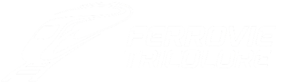
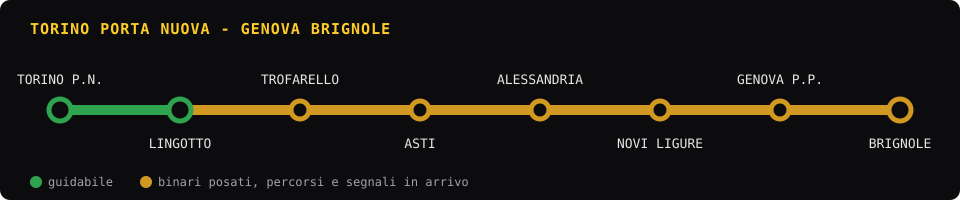

[Changelog](CHANGELOG.md) &nbsp;·&nbsp; [Game design](GAME_DESIGN.md) &nbsp;·&nbsp; [Discord](https://discord.gg/pH62fm3nkG)

 

Sto costruendo un simulatore ferroviario su Roblox partendo da una regola sola: i binari devono essere quelli veri. Le stazioni sono ricostruite dalle mappe ferroviarie, i segnali funzionano a blocchi come sulla linea vera, e in Sala Comandi un altro giocatore può fare il dirigente movimento mentre tu guidi.

È iniziato da Torino Porta Nuova e da lì si sta allungando verso Genova.

> [!NOTE]
> Il gioco è in sviluppo e non ancora pubblico. Gli aggiornamenti escono prima sul [Discord](https://discord.gg/pH62fm3nkG).

## Partenze

| Treno | Destinazione | Binario | Stato |
|:--|:--|:--:|:--|
| `R` | **Genova Brignole** via Asti, Alessandria | 1 | 🟡 binari posati, guidabile fino a Lingotto |
| `RV` | **Ventimiglia** via Savona | 3 | ⚪ in programma |
| `IC` | **Milano Centrale** via Novara | 7 | ⚪ in programma |

  

## In cabina

<!-- Metti qui 2 o 3 screenshot o una GIF: cabina, Sala Comandi, mappa delle stazioni.

  
  
  

-->

Componi il treno veicolo per veicolo, alzi il pantografo, carichi i freni e aspetti il verde. In banchina apri le porte dal lato giusto e lasci salire i passeggeri. Se in Sala Comandi c'è qualcuno, la partenza la decide lui.

## Parco rotabili

Ogni mezzo arriverà con le livree che ha avuto davvero in servizio.

| Rotabile | Livree | |
|:--|:--|:--:|
| **E464** | XMPR · Regionale · Intercity · Intercity Giorno · Frecciabianca · Trenord | 🟢 |
| **Mazinga** (semipilota) | Origine · XMPR · DTR | 🟢 |
| **MDVC** | Origine · XMPR · DTR | 🟢 |
| **POP** | DPR · Regionale · Trenord · Trenitalia Tper | 🟢 |
| **E652** | Origine · Blu orientale e grigio perla · XMPR · Mercitalia Rail | 🟢 |
| **MDCE** | XMPR · DTR | 🟡 |
| **Rock** | DPR · Regionale · Trenord · Trenitalia Tper | ⚪ |
| **TAF** | XMPR · DTR · Trenord · FNM · LeNord · Malpensa Express | ⚪ |
| **E405** | XMPR | ⚪ |
| **Taurus** (E190) | ÖBB Italia · FUC Ferrovie Udine Cividale | ⚪ |
| **Frecciargento** | Frecciargento · Frecciarossa | ⚪ |
| **Italo** | Italo | ⚪ |

🟢 nel gioco &nbsp; 🟡 in lavorazione &nbsp; ⚪ da fare

## Come è fatto

Per chi è curioso del lato tecnico

 

- Il treno non usa la fisica delle ruote: segue i punti del tracciato, e ogni cassa è costruita dai suoi due carrelli, così in curva si comporta come quella vera.
- I binari sono tile da 20 studs posati sui dati di OpenStreetMap, alla scala di 3,011 studs per metro, ricavata dalla distanza reale fra Porta Nuova e il ponte di corso Bramante.
- I percorsi dei treni vengono generati dai binari stessi, uno per ogni coppia di binario e destinazione.
- Il segnalamento è a blocchi con due sezioni di preavviso, e in stazione la partenza va autorizzata.

## Stato dei lavori

- [x] Torino Porta Nuova con 20 binari, gola e deposito
- [x] Sala Comandi e segnali di partenza
- [x] Collegamento reale Porta Nuova e Lingotto
- [ ] Linea per Genova guidabile fino in fondo
- [ ] Marciapiedi della nuova Lingotto
- [ ] Carri merci
- [ ] Livree per tutti i rotabili
- [ ] Genova Ventimiglia e Torino Milano

🇬🇧 English

 

I'm building a railway simulator on Roblox around one rule: the tracks have to be the real ones. Stations are rebuilt from railway map data, signals work in blocks like on the real line, and in the Control Room another player can dispatch traffic while you drive.

It started at Torino Porta Nuova and is now stretching towards Genova. The game is in development and not public yet; updates go out first on Discord.

| Train | Destination | Status |
|:--|:--|:--|
| `R` | Genova Brignole | tracks laid, drivable up to Lingotto |
| `RV` | Ventimiglia | planned |
| `IC` | Milano Centrale | planned |

Every train will come with the liveries it really wore in service, from XMPR to the new Regionale.

 

